

#### MSIN0097 Predictive Analytics

**Candidate Number:** XDHH9

**Final Word Count:** 1986

**Git Repository:** <https://github.com/BenM10/predictive_income_project>

## Executive Summary

This project examines binary income classification using the UCI Adult (1994 US Census) dataset. The objective is to predict whether an individual’s annual income exceeds $50,000 based on demographic and employment-related attributes. Such classification problems are common in socioeconomic research and financial risk modelling, where income level serves as a proxy for economic stability.

The workflow combined exploratory data analysis with a structured preprocessing pipeline, including targeted log transformations and categorical encoding. A range of models were evaluated, spanning logistic regression, decision trees, ensemble methods, and a neural network baseline. Performance was primarily assessed using ROC AUC and the F1-score for the minority (>50K) class to ensure robustness under class imbalance.

HistGradientBoostingClassifier achieved the strongest validation performance, with a ROC AUC of 0.9325 and an F1-score of 0.724. Ensemble methods consistently outperformed linear and single-tree approaches, indicating the importance of modelling nonlinear interactions. Exploratory Principal Component Analysis further suggested moderate high-dimensional structure within the feature space. Nevertheless, the age of the dataset and the fixed binary income threshold limit direct contemporary generalisation.

## 1. Obtain a Dataset and Frame the Predictive Problem

This project uses the UCI Adult dataset, derived from the 1994 US Census, to address a supervised binary income classification task. The objective is to predict whether an individual’s annual income exceeds $50,000 using demographic and employment-related attributes. This corresponds to roughly $110,000 in 2026 dollars, representing a comparatively high real income level. Such classification problems are common in applied socioeconomic analysis and financial risk modelling, where income acts as a proxy for economic stability.
The dataset contains fourteen demographic and employment-related attributes, including age, education level, marital status, occupation, working hours, and capital gains/losses.

The dataset is imbalanced, with approximately 76% of individuals earning <=$50K and 24% earning above this threshold. For this reason, overall accuracy is not an informative standalone metric; a model predicting only the majority class would appear strong while failing to identify higher earners. The primary evaluation metric is therefore ROC AUC, which assesses how effectively the model ranks higher-income individuals above lower-income individuals across all possible classification thresholds. This is complemented by the F1-score for the >50K class to ensure minority-class performance is not obscured.

Several limitations shape the scope of the analysis. The data reflects labour market conditions from 1994 and has limited direct applicability to contemporary contexts. The binary threshold constrains modelling flexibility and prevents regression-based approaches. As Census data is self-reported, measurement error is possible, and the cross-sectional design does not permit causal interpretation.

The workflow was designed around the Google Antigravity agent as a collaborator. The analysis was modularised into six notebooks allowing discrete components to be generated, reviewed, and integrated with minimal modification. Prompts specified evaluation criteria and modelling constraints, and outputs were manually verified through distribution checks and explicit leakage prevention (preprocessing fitted only on training data). Reproducibility was maintained using 'random_state = 42'.

## 2. Data Exploration and Insights

Exploratory analysis on the cleaned dataset of 48,842 observations and fourteen primary features to identify structural patterns and modelling risks. Figure 1 illustrates the distribution of the income target, with approximately 76% of individuals earning <=$50K and 24% earning above this threshold.

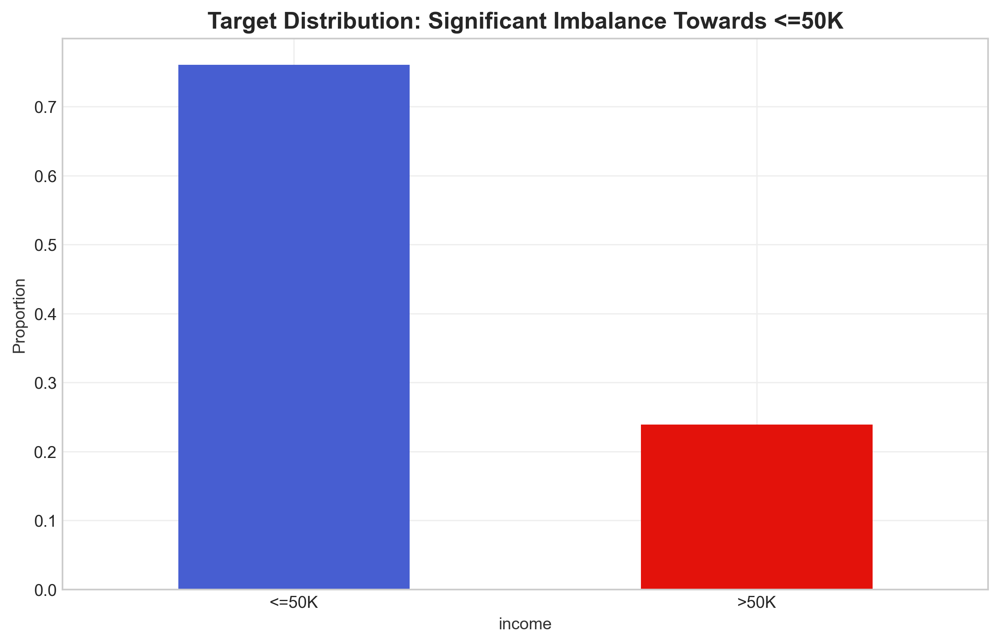{width=110%}

Several features exhibit distributional characteristics with direct modelling implications. The capital-gain variable is extremely right-skewed (Figure 2): most individuals report zero gains, whilst a small minority exhibit very large values. Without transformation, such heavy tails would disproportionately influence model fitting. This motivated the use of a log(1+x) transformation during preprocessing.

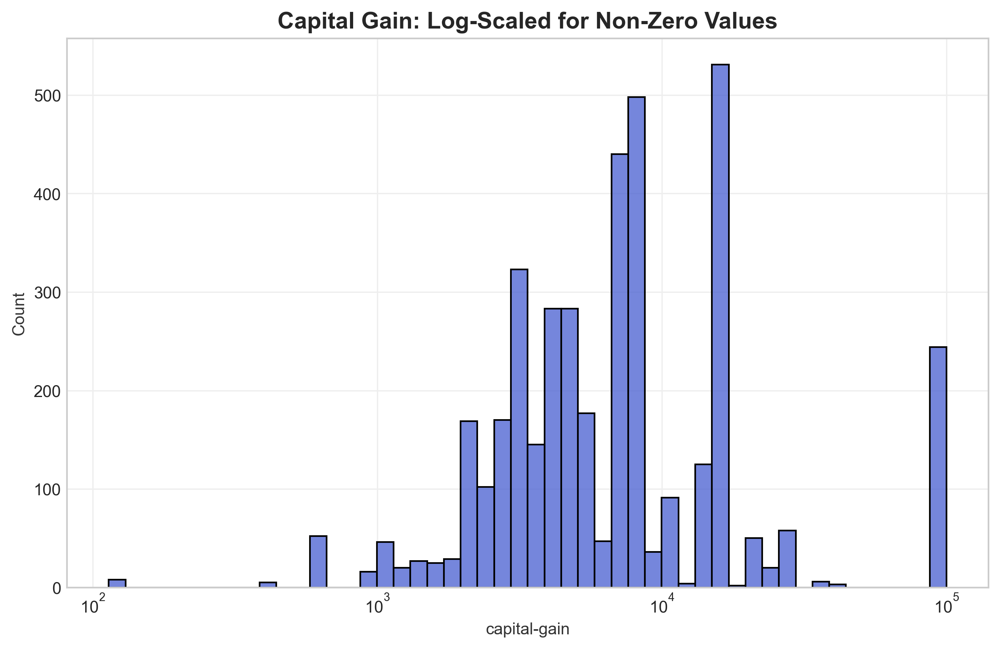{width=110%}

Education displays a clear monotonic association with income (Figure 3). The proportion of individuals earning >$50K increases steadily across education levels, suggesting strong predictive signal in both ordinal and categorical representations of education.

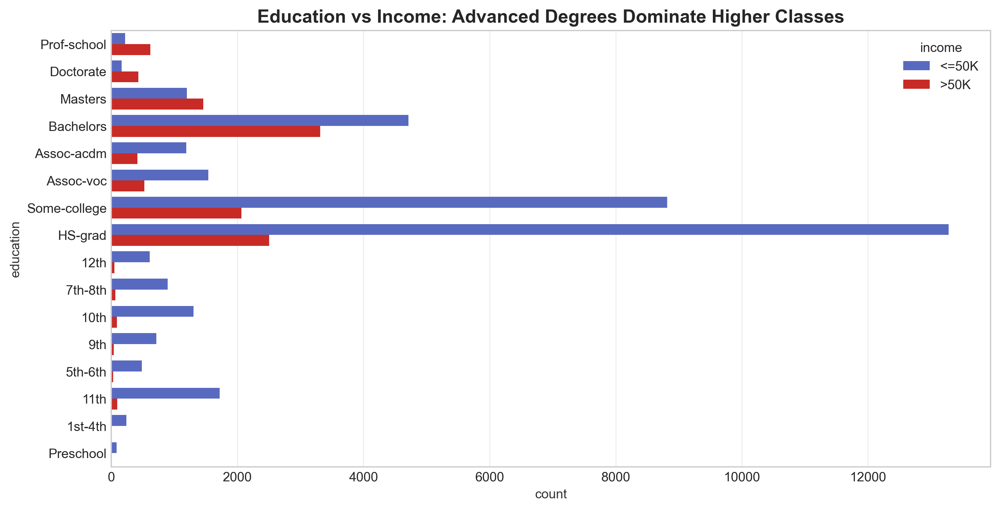{width=120%}

The distribution of hours-per-week (Figure 4) is concentrated around the standard 40-hour mark but exhibits meaningful dispersion and extreme values, indicating work intensity may contribute to income differentiation.

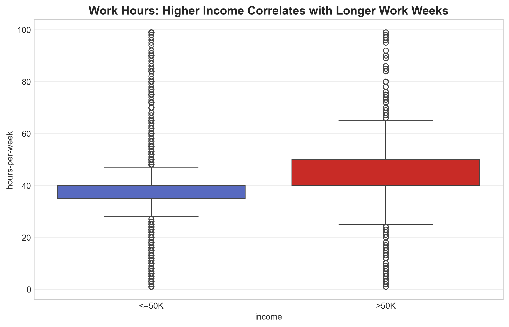{width=110%}

Missing values were present in workclass, occupation, and native-country, affecting roughly 7% of instances. Their structured appearance suggested that imputation, rather than deletion, would preserve information. Although the agent generated the initial visualisations, numerical summaries and class proportions were manually verified to ensure interpretations accurately reflected the underlying data prior to finalising preprocessing decisions.

## 3. Data Preparation

Preprocessing was implemented using a scikit-learn ColumnTransformer, enabling a modular and fully reproducible transformation pipeline. The dataset was partitioned into training (80%), validation (10%), and test (10%) subsets using stratified sampling on the income target. This preserved the approximately 76/24 class imbalance across splits. All procedures were executed with 'random_state = 42' to ensure consistent experimental replication. The pipeline design ensures that identical transormations can be re-applied in deployment without refitting on unseen data.

Categorical features were processed through a consistent pipeline comprising imputation followed by one-hot encoding. Missing values in workclass, occupation, and native-country were replaced with a constant "Unknown" category, preserving sample size while retaining potential signal from structured absence. Given the dominance of United States observations, native-country was further simplified into a binary distinction between "United-States" and "Other" to reduce sparsity and mitigate overfitting risk.

Numeric variables were treated separately. The heavily skewed capital-gain and capital-loss features were transformed using log(1+x), as motivated by their extreme right-tailed distributions observed during EDA. Remaining numeric features were standardised to ensure comparability for gradient-based models such as logistic regression and neural networks.

To prevent leakage, all preprocessing steps were fitted exclusively on the training data, with learned parameters applied unchanged to validation and test sets. Post-transformation checks confirmed zero missing values and a stable 67-dimensional feature space. Figures 5 and 6 demonstrate class proportions and age distributions remain consistent across splits, indicating stratification preserved the underlying data structure.

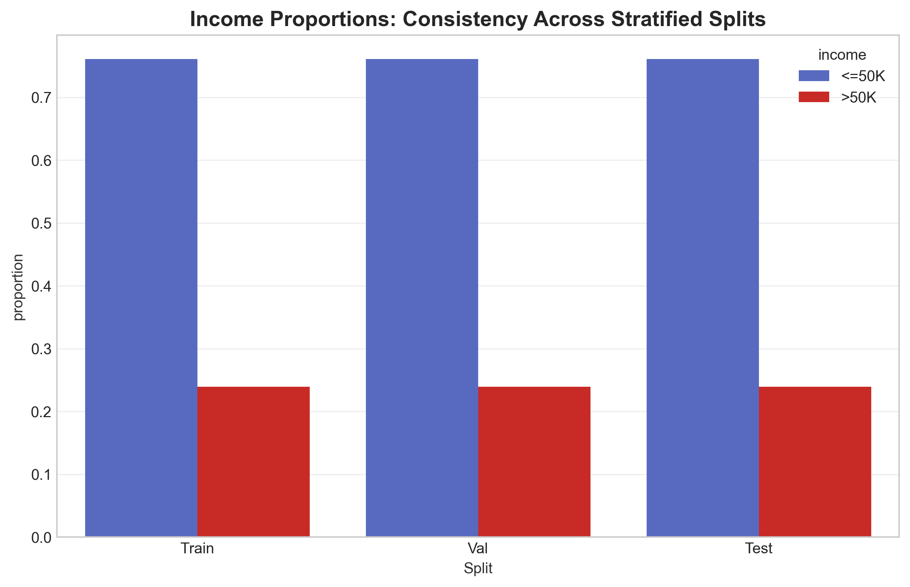{width=110%}

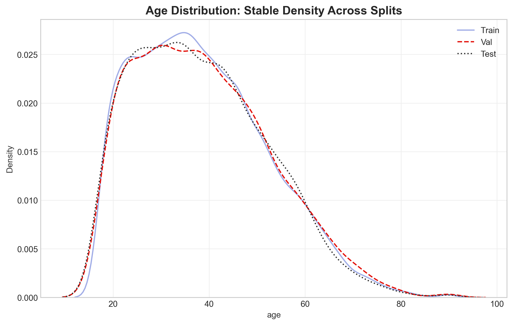{width=110%}

The overall preprocessing design, including the modular pipeline architecture and log transformation of skewed capital variables, was initially suggested by the agent. Each component was reviewed prior to execution and validated through dimensionality checks, inspection of transformed outputs, and confirmation that fitting was restricted to the training set.

## 4. Model Exploration and Shortlisting

The modelling stage began with the establishment of clear performance baselines. A dummy classifier, which predicts only the majority class, defined the minimum acceptable benchmark, whilst logistic regression provided a regularised linear reference model. With L2 regularisation applied, logistic regression achieved a validation ROC AUC of approximately 0.90. This indicated a meaningful proportion of the predictive signal could be captured through linear relationships alone and provided a credible benchmark for more flexible models.

To capture potential non-linear interactions, a decision tree was introduced with structural constraints applied via hyperparameter tuning (notably min_samples_leaf). Whilst increasing modelling flexibility, ensemble methods offered superior generalisation. Random Forest and HistGradientBoosting were evaluated using validation-based comparison. Among all candidates, HistGradientBoosting achieved the strongest performance, with a validation ROC AUC of 0.9325. As illustrated in Figure 7, the gradient boosting model consistently outperformed alternative approaches.

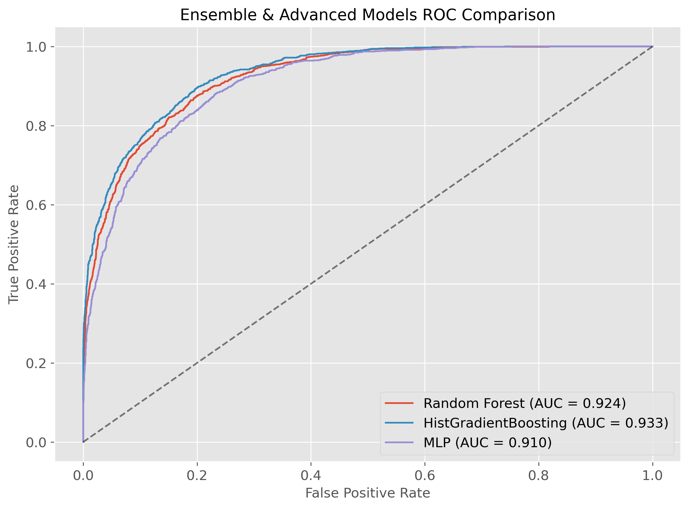{width=110%}

Importantly, the training ROC AUC (~0.94) exceeded validation performance only modestly (~0.93), suggesting controlled model complexity rather than substantial overfitting. This behaviour is further supported by the learning curve shown in Figure 8, where training and cross-validation scores converge smoothly as sample size increases. The iterative nature of boosting, sequentially correcting residual errors from earlier trees, likely explains its improved discriminative ability relative to single-tree and linear models.

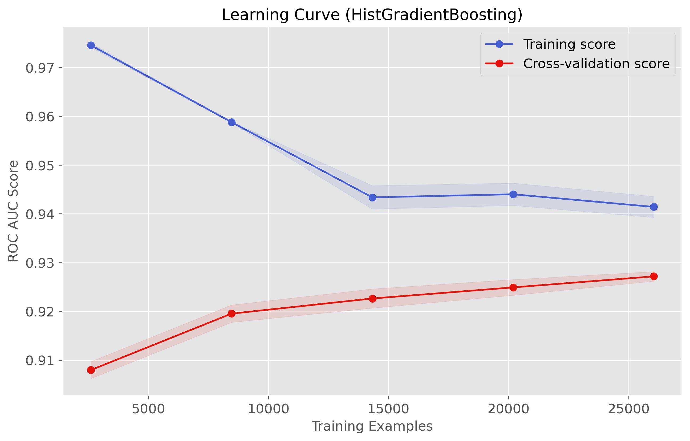{width=110%}

A multi-layer perceptron (MLP) was also evaluated, incorporating L2 regularisation through the alpha parameter. Although the neural network achieved a respectable ROC AUC of approximately 0.91, it did not surpass the ensemble methods. In this structured tabular setting, tree-based ensembles appeared better suited to modelling feature interactions.

Model shortlisting was based primarily on validation ROC AUC and minority-class F1-score. The test set was reserved strictly for final evaluation and remained untouched during model comparison. Feature scaling was applied consistently across all models for pipeline coherence; whilst tree-based methods do not require scaling, this unified approach simplified experimentation and did not adversely affect performance.

Model families were selected based on methodological considerations, while the agent assisted in proposing structured hyperparameter search spaces that were subsequently refined and validated.

## 5. Fine-Tune and Evaluate

The Histogram-based Gradient Boosting (HGB) model was tuned using GridSearchCV with three-fold cross-validation applied exclusively to the training partition. Hyperparameter selection was guided by maximising ROC AUC. Cross-validation was performed entirely within the training data, ensuring validation and test partitions remained unseen. The validation set was subsequently used to confirm the relative ranking of shortlisted models, whilst the test set was reserved for final performance estimation. This approach ensured performance estimates reflect genuine generalisation rather than accidental data leakage.

Final evaluation on the held-out test data demonstrates strong discriminative ability, illustrated by the confusion matrix (Figure 9). It shows that the model correctly identifies a substantial proportion of high-income individuals whilst maintaining a low false-positive rate, though some high earners remain misclassified due to overlapping demographic characteristics, reflecting the inherent difficulty of identifying all high-income individuals from cross-sectional demographic variables alone. This trade-off is consistent with the structure of the dataset and the limits of observable features. The relatively small gap between training and cross-validation ROC AUC (~0.94 vs ~0.93), shown previously in Section 4 (Figure 8), further indicates model complexity is controlled and performance gains are unlikely to be driven by overfitting.

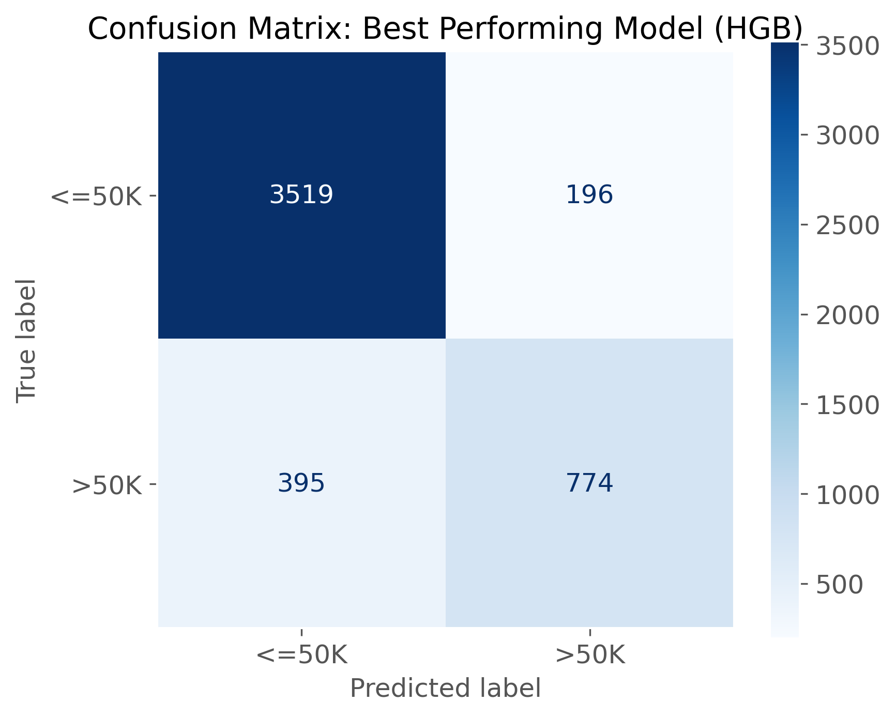{width=100%}

To better understand the structure of the feature space, Principal Component Analysis (PCA) was conducted on the transformed dataset. The cumulative explained variance plot (Figure 10) shows the first two principal components account for approximately 28% of total variance, while around ten components are required to reach roughly 75%. This dispersion suggests predictive information is distributed across multiple interacting dimensions rather than concentrated in a small number of dominant features. In parallel, exploratory KMeans clustering did not produce clean separation aligned with income labels, reinforcing that the classification boundary is not naturally clustered in low-dimensional space. These diagnostics provide further support for the use of supervised ensemble methods capable of modelling complex interactions.

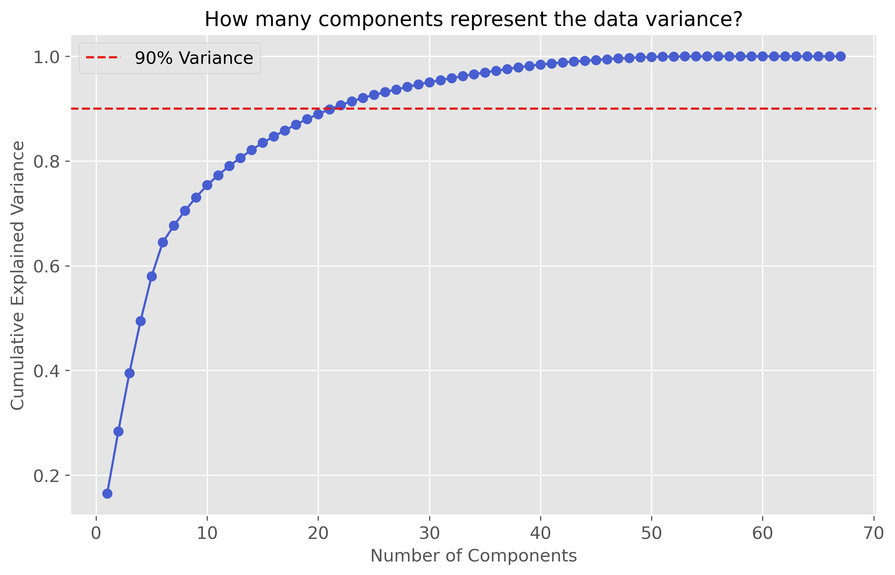{width=110%}

The agent-assisted workflow required active verification and correction. The handling of native-country was deliberately revised to a binary “United-States” versus “Other” representation after reviewing category sparsity and overfitting risk from agents' suggestion of having the top 3 countries and "Other" as separate categories. Additionally, limitations in automated notebook editing led to a modular structure in which agent-generated components were carefully reviewed and further modifications integrated as required. Whilst this introduced additional oversight, it strengthened traceability and ensured explicit validation at each stage of the modelling process.

## 6. Final Conclusions

This project demonstrated that structured, tabular income data can be modelled effectively using ensemble learning methods when evaluation discipline and leakage control are prioritised. While linear models captured substantial signal, Histogram-based Gradient Boosting consistently delivered superior discriminative performance, achieving strong ROC AUC and minority-class F1 scores with minimal evidence of overfitting. The modest generalisation gap between cross-validation and held-out evaluation supports the robustness of the final configuration.

Exploratory structural analysis further suggested that predictive signal is distributed across multiple interacting features rather than concentrated in a small number of dominant dimensions. This helps explain the relative success of boosting approaches over purely linear baselines.

However, predictive accuracy remains constrained by omitted socioeconomic variables and the fixed binary income threshold. The model captures patterns present in the 1994 Census structure but cannot infer causal relationships or guarantee performance under distributional shift. Future work could incorporate richer geographic or wealth indicators and explore calibration under contemporary data conditions.

### Model Card Summary: HGB (Histogram-based Gradient Boosting)

#### Intended Use: 
Binary income classification for structured datasets similar to the UCI Adult sample; suitable for benchmarking and academic modelling.

#### Not Intended For: 
Contemporary credit, hiring, or policy decisions without retraining on updated and context-specific data.

#### Data Provenance: 
UCI Adult dataset derived from 1994 U.S. Census records.

#### Evaluation Summary:
Test ROC AUC ~ 0.93; high precision and moderate recall for >50K class; controlled generalisation gap.

#### Key Caveats
Boosting may overfit subtle noise despite cross-validation safeguards.

## Appendix

### Appendix A - Agent Usage and Decision Log

The Antigravity agent was used throughout the project as a structured collaborator rather than a passive code generator. Prompts were planned in advance for each stage of the workflow (EDA, preprocessing, modelling, and evaluation), with clear expectations about outputs and verification steps. A decision log was automatically generated and updated during development to record proposed transformations, modelling choices, hyperparameter ranges, and any subsequent revisions. This log was later reviewed and summarised to ensure completeness and provide a transparent audit trail.

All agent-generated plans and code were manually inspected before integration. Numerical outputs, class distributions, dimensionality checks, and evaluation metrics were cross-validated against independent summaries to confirm correctness. Where inconsistencies arose, adjustments were made and documented. The project’s modular notebook structure supported this process by isolating each analytical stage, making verification more manageable and reducing the risk of compounding errors.

#### Agent Decision Log

| Stage | Agent Proposal | Our Decision | Verification |
| :--- | :--- | :--- | :--- |
| **EDA** | Set `na_values='?'` and `skipinitialspace=True` in loader. | Accept | Visual inspection of raw CSV files for leading spaces. |
| **EDA** | Include semantic column explanations in notebook. | Reject | User verification required prior to documenting feature meanings. |
| **Repo-Workflow** | Direct in-place editing of notebook cells. | Reject | Verification showed agent claimed edits failed to persist. |
| **Preprocessing** | Encode categorical missing values as "Unknown". | Accept | Frequency analysis showed missingness was non-random in attributes. |
| **Preprocessing** | Apply `log1p` transformation to skewed capital features. | Accept | Distribution analysis confirmed extreme right skew in capital data. |
| **Preprocessing** | Binary binning of `native-country` (US vs Other). | Modify | Cardinality check found extreme imbalance (>90% US-based). |
| **EDA** | Create `save_and_show` standardization helper. | Accept | Code review for DRY (Don't Repeat Yourself) compliance. |
| **Modelling** | Use GridSearchCV for Decision Tree pre-pruning. | Accept | Compared cross-validation scores against baseline holdout. |
| **Modelling** | Implement Grid Search with `cv=3` and `roc_auc`. | Accept | Computational resource check vs. scoring reliability. |
| **Diagnostics** | Conduct PCA and KMeans exploratory analysis. | Accept | Analyzed explained variance ratios and cluster silhouette scores. |

### Evidence Screenshots

{width=60%}

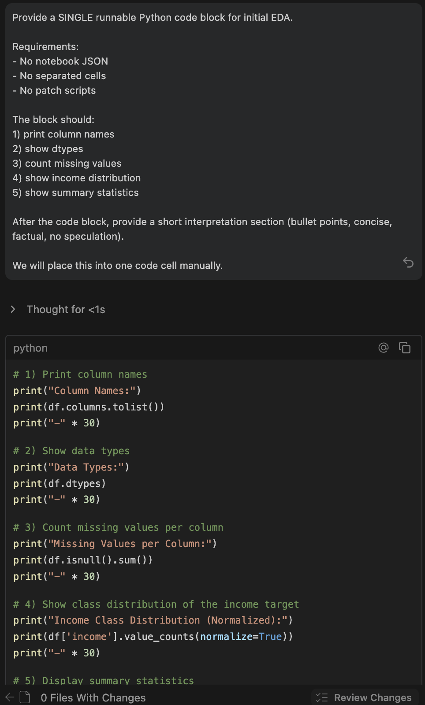{width=60%}

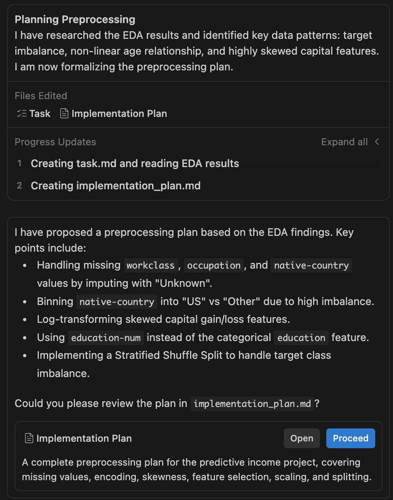{width=60%} 

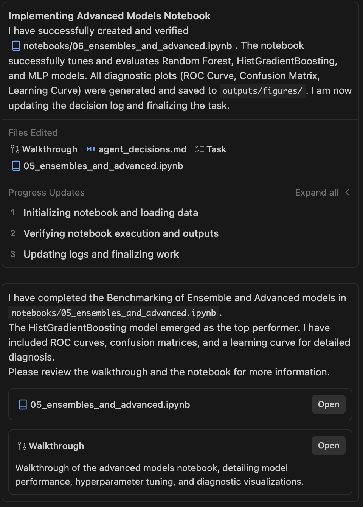{width=60%}

### Appendix B - Additional Figures

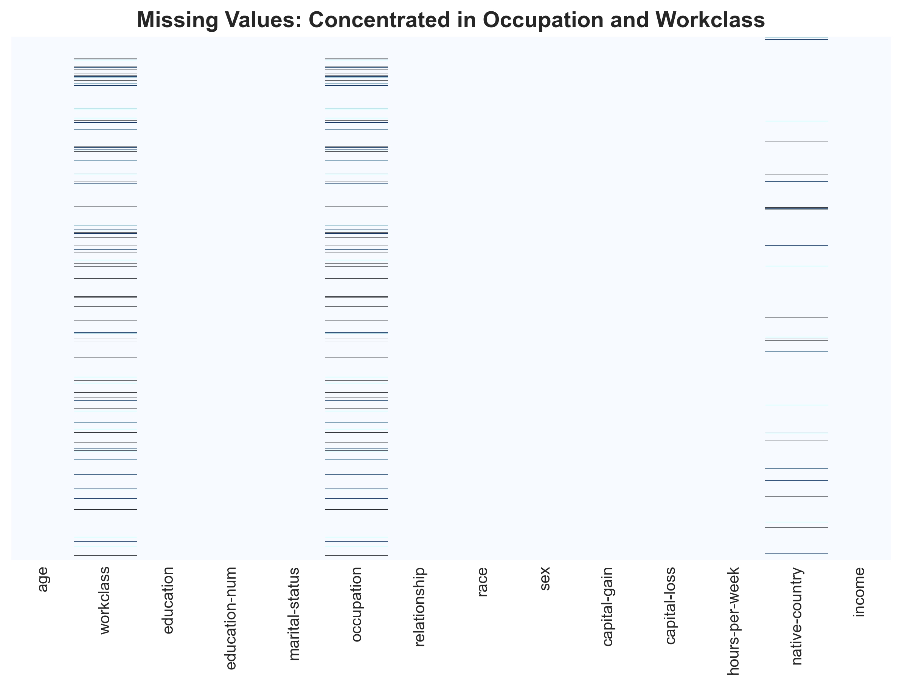{width=110%}

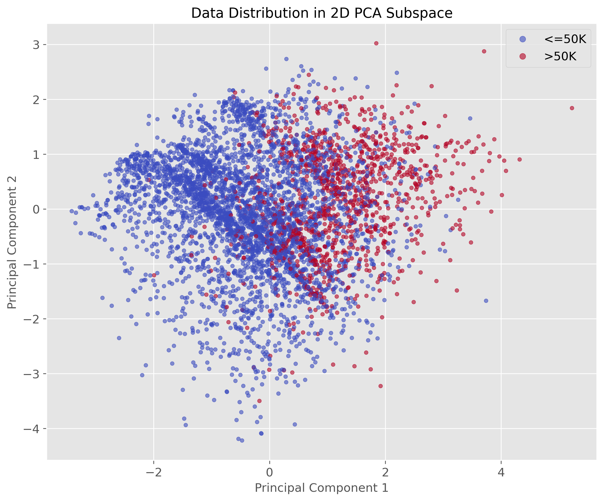{width=110%}

#### Dataset Variable Summary

| Variable        | Type        | Description |
|----------------|------------|-------------|
| age            | Numeric    | Age of the individual in years |
| workclass      | Categorical | Employment type (e.g., Private, Self-emp, Government) |
| education      | Categorical | Highest level of education achieved |
| education-num  | Numeric    | Ordinal encoding of education level |
| marital-status | Categorical | Marital status category |
| occupation     | Categorical | Occupational category |
| relationship   | Categorical | Relationship status within household |
| race           | Categorical | Self-reported race category |
| sex            | Categorical | Gender of the individual |
| capital-gain   | Numeric    | Annual capital gains |
| capital-loss   | Numeric    | Annual capital losses |
| hours-per-week | Numeric    | Number of hours worked per week |
| native-country | Categorical | Country of origin |
| income         | Binary Target | Annual income classification (>50K / <=50K) |

**Git Repository:** <https://github.com/BenM10/predictive_income_project>

## Bibliography

Dua, D. and Graff, C. (2019). *UCI Machine Learning Repository*. Irvine, CA: University of California, School of Information and Computer Science. Available at: https://archive.ics.uci.edu/dataset/2/adult.

Google Antigravity Agent Tool (2026). Agentic IDE using Gemini 3 Pro for execution. Available at: https://www.antigravity.google.

Pedregosa, F. et al. (2011). Scikit-learn: Machine Learning in Python. *Journal of Machine Learning Research*, 12, 2825–2830.